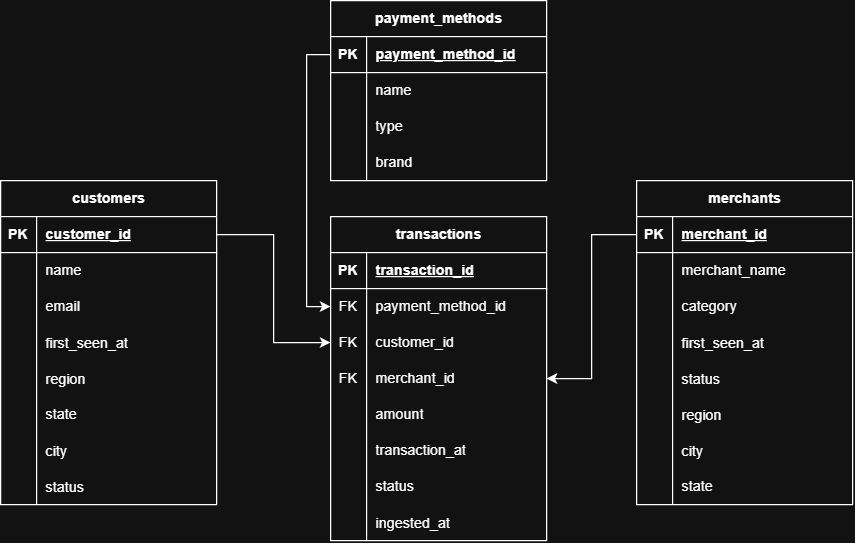
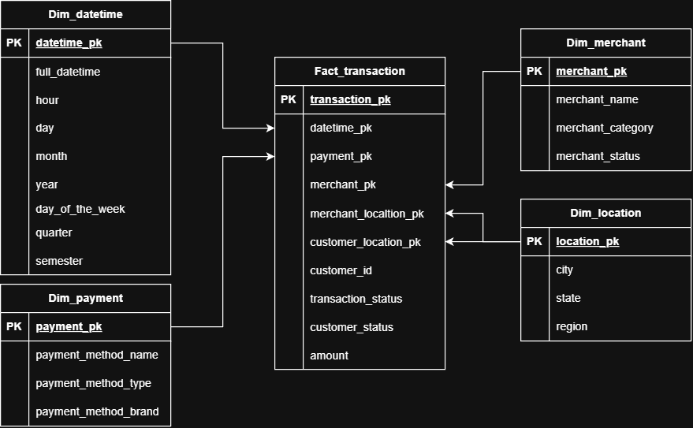
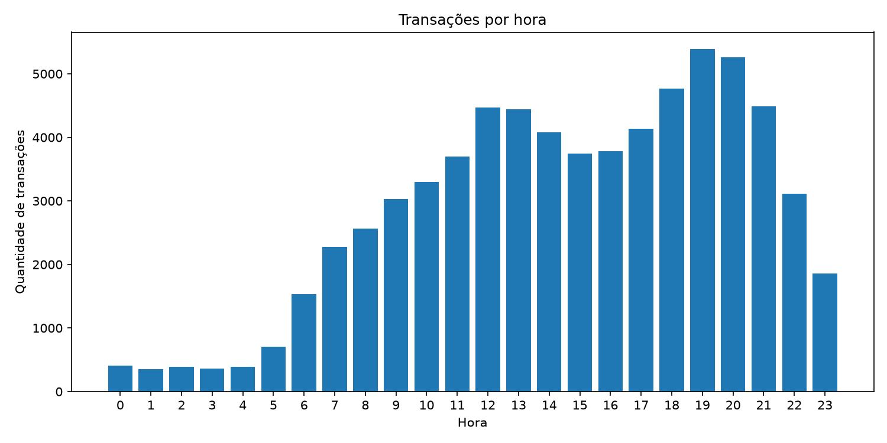
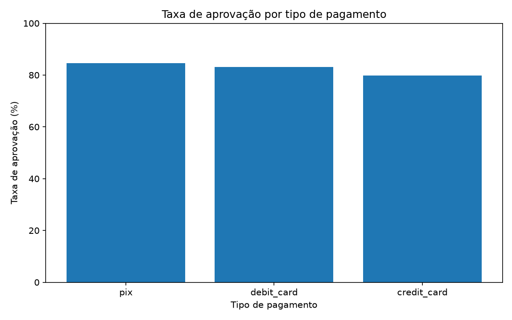
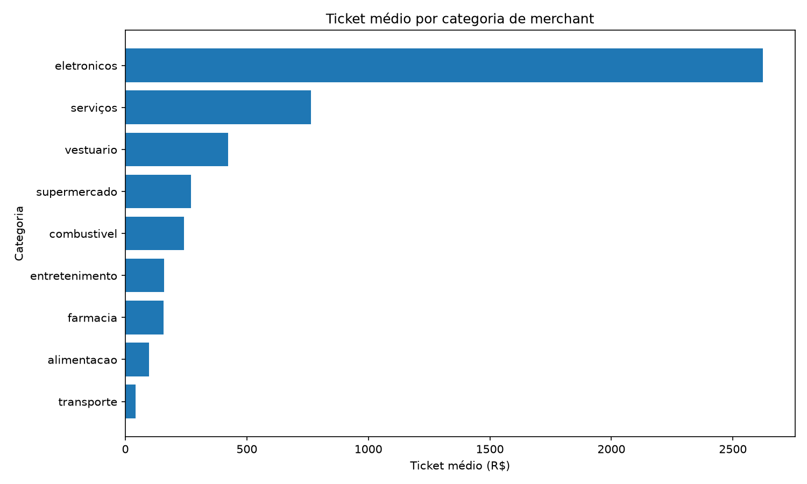
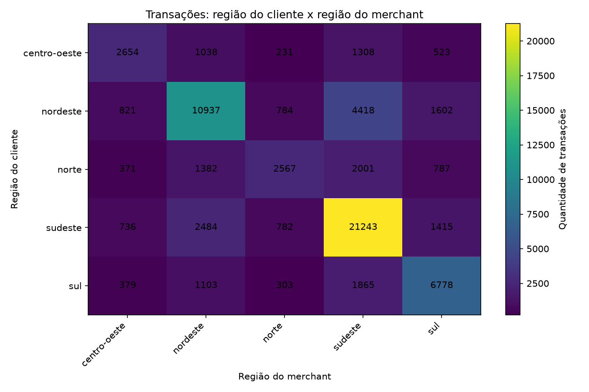
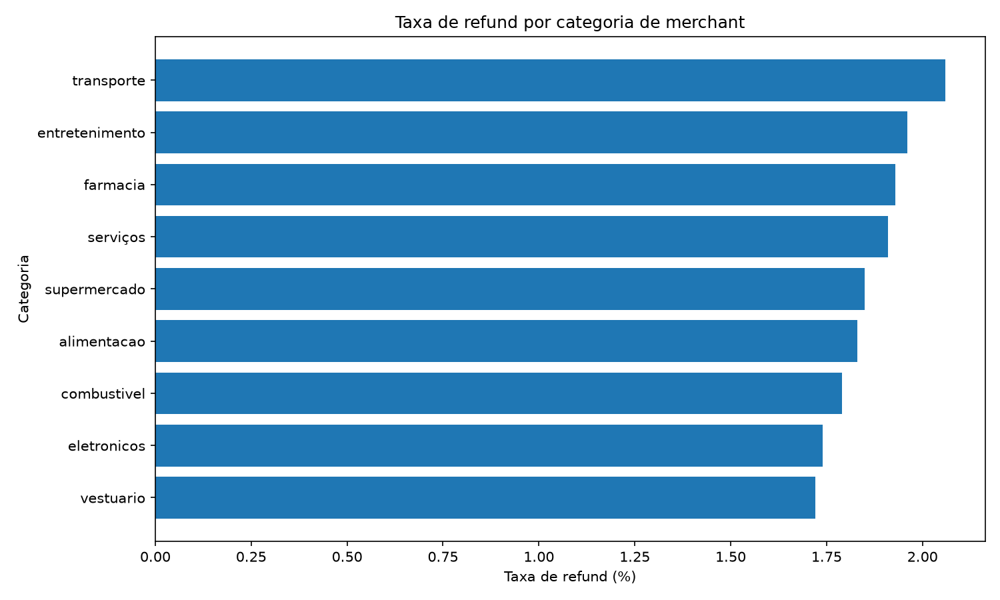

# PayFlow Data Pipeline

Pipeline de dados ponta a ponta para processamento e análise de transações de pagamento, desenvolvido com foco em boas práticas de engenharia de dados, modelagem relacional, modelagem dimensional e processamento incremental.

O projeto simula um cenário de pagamentos no qual dados transacionais chegam em lotes diários no formato JSONL, são ingeridos em uma camada Bronze, tratados e normalizados na Silver e, por fim, transformados em um modelo dimensional na Gold para consumo analítico.

> O gerador de dados sintéticos possui documentação própria e não é detalhado neste README.

---

## Visão geral

```text
Gerador de dados sintéticos
        ↓
Arquivos JSONL diários
        ↓
Ingestão incremental
        ↓
Bronze
(raw / desnormalizada)
        ↓
Transformação incremental
        ↓
Silver
(limpa / confiável / normalizada)
        ↓
Transformação incremental
        ↓
Gold
(modelo dimensional)
        ↓
SQL analítico + Pandas + Matplotlib
        ↓
Gráficos e insights
```

O pipeline foi construído para que cada camada tenha uma responsabilidade clara:

- **Bronze:** preserva o dado recebido, incluindo inconsistências de qualidade.
- **Silver:** limpa, valida, rejeita registros inválidos e organiza os dados em um modelo relacional normalizado.
- **Gold:** reorganiza os dados de acordo com necessidades analíticas, utilizando um modelo dimensional.
- **Analytics:** executa consultas agregadas diretamente no PostgreSQL e utiliza Python apenas para consumo e visualização.

---

## Tecnologias

- Python
- PostgreSQL
- SQL
- psycopg
- Pandas
- Matplotlib
- python-dotenv
- Git / GitHub
- Docker

---

## Dados de origem

O projeto utiliza um gerador próprio de dados sintéticos que produz arquivos JSONL diários contendo transações de pagamento e snapshots desnormalizados de:

- clientes;
- merchants;
- métodos de pagamento.

Foram gerados **45 arquivos diários**, totalizando **69.718 registros físicos** na Bronze.

O gerador também introduz propositalmente alguns problemas de qualidade, como:

- diferenças de caixa e espaços em campos textuais;
- e-mails inconsistentes;
- regiões incompatíveis com o estado;
- valores de transação inválidos;
- IDs nulos;
- status fora do domínio esperado;
- métodos de pagamento inválidos;
- duplicatas exatas.

Esses problemas são mantidos na Bronze e tratados apenas na transformação para Silver.

---

## Arquitetura Medallion

### Bronze

A Bronze representa o dado bruto recebido do sistema de origem.

A tabela principal é:

```text
bronze.transactions_raw
```

Além dos campos de negócio, são adicionados dois metadados técnicos:

- `source_file`: arquivo JSONL de origem;
- `ingested_at`: momento da ingestão.

A Bronze não possui regras de qualidade como `PRIMARY KEY`, `UNIQUE`, `CHECK` ou `NOT NULL`, pois seu objetivo é preservar o dado recebido.

### Incrementalidade da ingestão

A ingestão é incremental por arquivo.

A tabela:

```text
pipeline.processed_files
```

registra quais arquivos já foram carregados para a Bronze.

Cada arquivo é processado dentro de sua própria transação no PostgreSQL. O arquivo só é marcado como processado depois que todas as linhas foram inseridas com sucesso.

Assim, uma nova execução ignora arquivos já carregados e processa apenas novos lotes.

---

## Silver

A Silver contém dados limpos, confiáveis e organizados em um modelo relacional normalizado.

### Modelo relacional




Principais tabelas:

```text
silver.customers
silver.merchants
silver.payment_methods
silver.transactions
silver.rejected_transactions
```

Também existe uma tabela auxiliar de estados e regiões utilizada para corrigir inconsistências geográficas.

### Regras de tratamento

Entre as transformações realizadas estão:

- normalização de caixa e espaços;
- padronização de e-mails;
- reconstrução da região a partir do estado;
- correção de tipos de método de pagamento a partir de ocorrências válidas;
- remoção lógica de duplicatas de transação;
- rejeição de transações com:
  - valor menor ou igual a zero;
  - `transaction_id` nulo;
  - `customer_id` nulo;
  - `transaction_status` inválido.

Transações inválidas não são apagadas da Bronze. Elas são registradas em:

```text
silver.rejected_transactions
```

### Resultado da primeira carga

A primeira transformação Bronze → Silver produziu:

| Resultado | Quantidade |
|---|---:|
| Transações válidas | 68.512 |
| Transações rejeitadas | 1.087 |
| Clientes | 2.000 |
| Merchants | 250 |
| Métodos de pagamento | 8 |
| Duplicatas físicas identificadas | 119 |

Os números são consistentes com os **69.718 registros físicos** armazenados na Bronze.

### Incrementalidade da Silver

A transformação Silver também é incremental por arquivo.

A tabela:

```text
pipeline.silver_processed_files
```

registra os arquivos da Bronze já transformados.

O processo cria um batch temporário apenas com registros de arquivos ainda não processados e executa toda a transformação dentro de uma única transação.

O arquivo só é marcado como processado ao final da transformação.

---

## Gold

A Gold utiliza um modelo dimensional voltado para consultas analíticas.

### Modelo dimensional




O grão da fato é:

> **1 linha em `gold.fact_transaction` representa 1 transação válida da Silver.**

O modelo é composto por:

```text
gold.fact_transaction
gold.dim_datetime
gold.dim_payment
gold.dim_merchant
gold.dim_location
```

### Dimensões

**`dim_datetime`**

Possui grão horário. Cada linha representa uma hora específica de uma data específica.

Exemplos de atributos:

- hora;
- dia;
- mês;
- ano;
- dia da semana;
- trimestre;
- semestre.

**`dim_payment`**

Representa métodos de pagamento e seus atributos:

- nome;
- tipo;
- bandeira.

**`dim_merchant`**

Contém atributos analíticos dos merchants:

- nome;
- categoria;
- status.

**`dim_location`**

É utilizada em dois papéis diferentes pela tabela fato:

- localização do cliente;
- localização do merchant.

Isso permite análises cruzando origem e destino regional das transações sem duplicar a dimensão.

### Fato

A `fact_transaction` armazena:

- chave da transação;
- chaves das dimensões;
- `customer_id`;
- status da transação;
- status do cliente;
- valor da transação.

Após a primeira carga:

```text
gold.fact_transaction = 68.512 registros
```

O valor é igual ao total de transações válidas da Silver, respeitando o grão definido.

### Incrementalidade da Gold

Na Gold, a incrementalidade é baseada no próprio identificador da transação.

Uma transação entra no batch apenas quando existe na Silver e ainda não existe em:

```text
gold.fact_transaction
```

As dimensões utilizam suas chaves naturais/business keys com `ON CONFLICT DO NOTHING`, evitando duplicação.

Assim, cada camada utiliza um mecanismo de incrementalidade adequado ao seu contexto:

```text
JSONL → Bronze    : source_file
Bronze → Silver   : source_file processado
Silver → Gold     : transaction_id
```

---

## Analytics

A camada `analytics/` demonstra o consumo efetivo do modelo dimensional.

As agregações são executadas em SQL diretamente no PostgreSQL. O Python recebe apenas os resultados agregados em DataFrames e utiliza Matplotlib para gerar as visualizações.

```text
Gold / PostgreSQL
        ↓
Consultas SQL
        ↓
Pandas DataFrame
        ↓
Matplotlib
        ↓
PNG
```

Consultas implementadas:

```text
analytics/queries/
├── transactions_by_hour.sql
├── approval_rate_by_payment.sql
├── merchant_category_metrics.sql
├── transactions_by_region.sql
└── refund_rate_by_category.sql
```

As análises permitem observar, entre outros aspectos:

- concentração de transações ao longo do dia, com maior volume no período da noite;
- diferenças de taxa de aprovação entre Pix, débito e crédito;
- diferenças relevantes de ticket médio entre categorias de merchant;
- comportamento regional entre clientes e merchants;
- variação da taxa de refund entre categorias.

### Exemplos de saída

#### Transações por hora



#### Taxa de aprovação por tipo de pagamento



#### Ticket médio por categoria de merchant



#### Região do cliente x região do merchant



#### Taxa de refund por categoria de merchant



---

## Estrutura do projeto

Uma visão simplificada da organização:

```text
payflow/
├── generator/
│   └── README.md
│
├── ingestion/
│   └── ...
│
├── sql/
│   └── ...
│
├── analytics/
│   ├── queries/
│   │   ├── transactions_by_hour.sql
│   │   ├── approval_rate_by_payment.sql
│   │   ├── merchant_category_metrics.sql
│   │   ├── transactions_by_region.sql
│   │   └── refund_rate_by_category.sql
│   │
│   ├── outputs/
│   │   └── *.png
│   │
│   └── run_analysis.py
│
├── docker-compose.yml
├── run_pipeline.py
├── requirements.txt
├── .env.example
├── .gitignore
└── README.md
```

---

## Configuração e execução

O projeto utiliza **Docker para executar o PostgreSQL**, portanto não é necessário ter PostgreSQL instalado localmente.

### Pré-requisitos

- Python 3
- Docker / Docker Compose
- Git

### 1. Instalar as dependências Python

As dependências estão definidas em `requirements.txt`:

```text
psycopg[binary]
python-dotenv
pandas
matplotlib
```

Instale com:

```bash
pip install -r requirements.txt
```

### 2. Configurar as variáveis de ambiente

O arquivo `.env.example` contém o modelo das variáveis necessárias.

Crie uma cópia chamada `.env` na raiz do projeto e preencha os valores desejados:

```env
POSTGRES_HOST=localhost
POSTGRES_PORT=5433
POSTGRES_DB=payflow
POSTGRES_USER=postgres
POSTGRES_PASSWORD=sua_senha
```

No PowerShell, a cópia pode ser feita com:

```powershell
Copy-Item .env.example .env
```

O `.env` é utilizado tanto pelo Docker para configurar o PostgreSQL quanto pelos scripts Python para realizar a conexão com o banco.

> O arquivo `.env` contém credenciais locais e não deve ser versionado. O `.env.example` permanece no repositório apenas como referência.

### 3. Executar o pipeline

Na raiz do projeto, execute:

```bash
python run_pipeline.py
```

O script automatiza o fluxo principal:

```text
Docker / PostgreSQL
        ↓
criação dos schemas, tabelas e índices
        ↓
geração dos arquivos JSONL
        ↓
ingestão incremental → Bronze
        ↓
transformação incremental → Silver
        ↓
transformação incremental → Gold
        ↓
consultas analíticas e geração dos gráficos
```

O PostgreSQL é executado em um container Docker e o banco `payflow` é criado a partir das configurações do `.env`.

Os dados gerados são gravados em:

```text
data/incoming/
```

e os gráficos produzidos ao final do pipeline são salvos em:

```text
analytics/outputs/
```

### Execução manual das análises

Caso a Gold já esteja carregada e seja necessário executar apenas as análises:

```bash
python analytics/run_analysis.py
```

### Docker

O container também pode ser iniciado manualmente com:

```bash
docker compose up -d
```

Para verificar o estado:

```bash
docker compose ps
```

Para visualizar os logs do PostgreSQL:

```bash
docker compose logs postgres
```

Para parar os containers sem apagar os dados:

```bash
docker compose down
```

## Decisões de projeto

Algumas decisões foram tomadas deliberadamente para manter o projeto simples, coerente e próximo de um pipeline real:

- o dado bruto não é corrigido na Bronze;
- rejeições são rastreadas em vez de apagadas;
- Bronze e Silver possuem controle explícito de arquivos processados;
- a Gold usa o próprio grão da fato para identificar novas transações;
- a Silver utiliza modelagem relacional normalizada;
- a Gold utiliza modelagem dimensional voltada a consumo analítico;
- agregações analíticas são executadas no PostgreSQL, evitando mover dados desnecessariamente para Python;
- credenciais são separadas do código por variáveis de ambiente.

---

## Objetivo do projeto

O PayFlow foi desenvolvido como um projeto de estudo e portfólio em Engenharia de Dados.

O objetivo não é reproduzir uma plataforma de pagamentos em escala de produção, mas demonstrar de forma prática conceitos como:

- ingestão de dados em lotes;
- processamento incremental;
- qualidade de dados;
- transações no PostgreSQL;
- arquitetura Medallion;
- modelagem relacional;
- modelagem dimensional;
- SQL analítico;
- consumo de dados com Python;
- versionamento de código e scripts de banco de dados.

